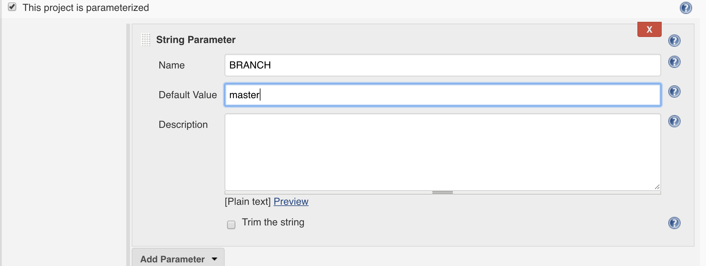
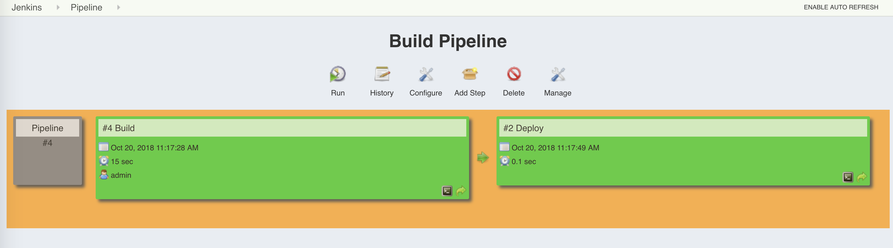
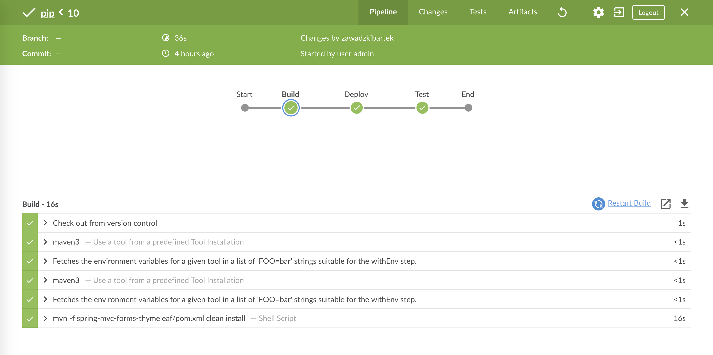

:toc: macro
:toc-title:
:toclevels: 99

image::https://www.vectorlogo.zone/logos/jenkins/jenkins-card.png[]

toc::[]

## Po co Jenkins ?

### Problemy z pracą w zespole ?

Podczas pracy kilku osób nad tym samym kodem mogą pojawić się pewne problemy:

- Dużo zmian
- Dużo powtarzalnych czynności
- Nie zawsze sprawdzamy czy nasz kod się kompiluje
- U mnie działa !?
- mvn clean install -DskipTests
- Lokalny cache

- Wizualizacja procesów SDLC (code, build, tests, deploy)

i inne ...

### CI - Continuous Integration

Jest to technika polegająca na ciągłym wdrażaniu/mergowaniu nowego kodu ze starym i poddawaniu
go testom aby utrzymać zawsze działającą wersję programu.

- testy na branchu
- testy podczas PR (merge mastera/developa do brancha i uruchomienie na nim testów
- testy po zmergowaniu do mastera/developa i veryfikacja wersji
- codzienne merge mastera do feature branchy

i inne ...

### CD - Continuous Delivery

Poza procesem CI przygotowanie artefaktu do wdrożenia na każde środowisko łącznie z produkcją

### CD - Continuous Deployment

image::https://puppet.com/sites/default/files/2016-09/puppet_continuous_diagram.gif[]

### DevOps

image::https://cdn-images-1.medium.com/max/2000/1*EBXc9eJ1YRFLtkNI_djaAw.png[]

### Problemy z Jenkinsem ?

image::https://wiki.jenkins-ci.org/download/attachments/2916393/fire-jenkins.svg[]

- brak standardów - pluginy

### Alternatywy

- Bamboo
- TeamCity
- GitLab CI/CD

SaaS:

- Travis
- Circle CI
- Codeship

image::https://encrypted-tbn0.gstatic.com/images?q=tbn:ANd9GcTKDJlMQsftd8zONI0VexPu2_T_Os9JntMjYX9smmidTvjWeIGk[]

## Setup

Pobierz obraz jenkinsa z docker hub'a jenkinsci/blueocean:1.3.6
a następnie uruchom go w kontenerze docker'a z wystawionym portem 8383 -> 8080

    sudo docker network create infoshare-ci
    sudo docker run -u root -p 8383:8080 -p 8585:8585 -p 50000:50000 -v /var/run/docker.sock:/var/run/docker.sock jenkinsci/blueocean:1.9.0
    sudo docker run -d -p 4444:4444 selenium/standalone-chrome:3.14.0-helium

    ➜  ~ docker ps
    CONTAINER ID        IMAGE                                      COMMAND                  CREATED              STATUS              PORTS                                                                      NAMES
    526179f67ee9        selenium/standalone-chrome:3.14.0-helium   "/opt/bin/entry_poin…"   54 seconds ago       Up 53 seconds       0.0.0.0:4444->4444/tcp                                                     infallible_lamarr
    6d04062dc712        jenkinsci/blueocean:1.9.0                  "/sbin/tini -- /usr/…"   About a minute ago   Up About a minute   0.0.0.0:8585->8585/tcp, 0.0.0.0:50000->50000/tcp, 0.0.0.0:8383->8080/tcp   flamboyant_snyder
    ➜  ~ docker network connect --alias=chrome infoshare-ci 526179f67ee9
    ➜  ~ docker network connect --alias=jenkins infoshare-ci 6d04062dc712

po uruchomieniu jenkinsa należy wpisać adres w przeglądarce

    http://localhost:8383

ewentualnie 127.0.0.1:8383

powinno pojawić się okno

hasło do pierwszego zalogowania możemy znaleźć
w logu docker'a:

lub możemy podłączyć się do powłoki bash w naszego kontenera za pomocą

    1. docker exec -it elegant_swanson bin/bash
    2. cat /var/jenkins_home/secrets/initialAdminPassword
    3. -> 3809403dadbc4cd29299e6825d5d3a42

po wpisaniu hasła w kolejnym oknie wybieramy install suggested plugins

po zainstalowaniu się wszystkich pluginów
możemy stworzyć kolejnego użytkownika admin'a

WAŻNE nie podajemy username admin, ponieważ po podaniu initial password już
jesteśmy na tym użytkowniku, tutaj możemy stworzyć kolejnego użytkownika typu admin.

Wpisz swoje imie i nazwisko a hasło ustaw na 12341234
(oczywiście tylko w celach ćwiczeniowych na produkcji tak nie rób ;) )

po stowrzeniu użykownika klikaj dalej, dalej aż dojdziesz do ekranu startowego

## Konfiguracja

Zanim zaczniemy konfigurować buildy musimy zainstalować i ustawić konfigurację narzędzi.

Wchodzimy w manage jenkins
znajdziemy tam takie zakładki jak:

 - configure system

 czyli konfiguracja git'a, zmiennych systemowych, smtp
 shell'a, pipeline oraz innych ustawień które mogą się tam pojawić
 wraz z nowymi pluginami

 - configure global security

 czyli ustawienia ssh, ldap, token oraz wszystkie co jest związane
 z dostępem do jenkinsa, również mogą się tam pojawić inne ustawienia
 w zalerzności od zainstalowanych pluginów

 - configure credentials

 czyli ustaienia dostępów do serwisów zewnętrznych takich jak
 github, jira, docker i inne

 - global tool configuration

 czyli ustawienia narzędzi, java, maven, ant, gradle,
 docker, git

 - manage plugins

 moduł do instalacji i aktualizacji pluginów

 - system information

 informacje o system, zmiennych środowiskowych i jego parametrach

 - manage nodes

 moduł do zarządzania nodami jenkinsa

 - manage users

 czyli możliwość dodawania/edycji i usuwania użytkowników jenkinsa

są tam również inne moduły/strony konfiguracja jednak narazie są nam mniej potrzebne

następnie musimy zainstalować kilka pluginów:

    - Build pipeline
    - Copy artifact

Bardzo dużą zaletą jenkinsa jest to, że jest opensource
i posiada bardzo dużą bazę pluginów, do wszystkiego.

wybieramy Manage Plugins
a następnie instalujemy build pipeline plugin i copy artifact plugin
bez restartu jenkinsa

image::images/buildpipeline.png[]

musimy przejść jeszcze do zakładki global tool configuration

i dodać instalację mavena, w polu name wpisz maven3

## Build

Jeśli mamy już gotową konfigurację możemy stworzyć swojego pierwszego job'a

aby to zrobić należy na głównie stronie kliknąć w przycisk 'New Item'

powinna otworzyć się nam następująca strona

image::images/createjob.png[]

wpiszmy sobie nazwę joba 'my-first-job'
oraz wybierzmy freestyle project

po otwarciu strony konfiguracji job'a

mamy kilka sekcji do uzupełnienia

### SCM / Source Code Management

Sekcja VCS odpowiada z systemy kontroli wersji, między innymi git.

#### Zadanie 1a

Dodaj checkout kodu z githuba https://github.com/infoshareacademy/jdqz2-jenkins

wybierz opcję Git następnie
w polu Repository Url wpisz https://github.com/infoshareacademy/jdqz2-jenkins
kolejnym krokie jest dodanie dostępu, w chwili obecnej powinnien nam się pojawić czerwony komunikat.
Aby dodać dostęp należy kliknąć w przycisk Add poniżej pola z Url'em repozytorium
i tam uzupełnić nasze dane do github'a.
Następnie należy w polu branch wpisać nazwę swojego brancha i kliknąć save.

Uruchom Build klikająć w przycisk Build Now w widoku stworzonego Job'a

otwórz Workspace powinny znajdować się tam wszystkie pliki z repozytorium.

#### Zadanie 1b

Otwórz ponownie konfigurację buila klikając w Configure
i przejdź do sekcji Build Triggers
ustaw tam Poll SCM tak jak na zrzucie ekranu

a następnie zapisz konfigurację.

dodaj nowy plik do swojego brancha w głównym folderze
nazwij go trigger-<imie>-<nazwisko>
dodaj go do git'a zcommituj i zrób push do github'a

Przejdź do widoku swojego job'a w jenkinsie i zobacz co się stanie.
Build powinnień uruchomić się automatycznie.
Gdy się skończy przejdź do Workspace i sprawdź czy znajduje się tam twój plik.

### Build steps

Sekcja build steps umożliwia wykonywanie akcji na naszym workspace'ie
oraz uruchamianie innych skryptów/poleceń które możemy wykonywać z terminala.

#### Zadanie 2

Zmienn nazwę job'a z my-first-job na Build
można to zrobić w widoku job'a klikając na przycisk Rename

Otwieramy ponownie konfigurację job'a
i dodajemy nowy build step - Invoke Maven targets

następnie klikamy w advence i uzupełniamy step.
W polu maven version wybieramy ten tool ktory konfigurowaliśmy na samym początku czyli
maven3.
W polu goals nie podajemy mvn tylko same gole np. clean install
W polu pom musimy podać gdzie znajduje się nasz plik pom.xml uzupełnij to tak jak na
zrzucie ekranu

Uruchom build sprawdź czy będzie zielony/niebieski a następnie
przejdź do Workspace i sprawdź czy znajduje się tam folder /target oraz plik jar wewnątrz.

### Build parametryzowany

Build można paramteryzować, czyli przekazywać mu jakieś dane wejsciowe.
W sekcji general klikamy w checkboox This project is parametrized
i dostajemy możliwość wyboru paramterów.

#### Zadanie 3

Dodaj możliwość wyboru brancha za pomocą parametru.

Dodaj parametr typu String do swojego Joba,
nadaj mu nazwę BRANCH oraz wartość domyślną którą jest twój branch

następnie aby ten paramter był wykorzystywany jako wartość branch'a
trzeba zmienić lekko konfigurację SCM.

dodaj branch tak jak na zrzucie ekranu.

Zapisz konfigurację.

Teraz podczas uruchamiania jobu pojawi się dodatkowe okno gdzie można podać
nazwę brancha.

Zbuduj najpierw z domyślną wartością swój branch, później uruchom build ponownie
ale jako wartość brancha podaj branch osoby z ławki obok.
Po zbudowaniu zobacz w Workspace czy masz plik który tworzyliśmy w zadaniu 1b.

### Pipeline

Buildy można ze sobą łączyć ;)

#### Zadanie 4a

Stworz nowy job i skopiuj do niego artefakt z poprzedniego
a następnie go uruchom.

Zacznijmy od stworzenia nowego buildu, nazwij go Deploy.
Wewnątrz konfiguracji dodaj nowy build step copy artifacts from another build.

oraz kolejny krok Execute Shell:

   BUILD_ID=dontKillMe
   if [ $(pidof apka) ]
   then
   kill $(pidof apka)
   fi
   bash -c "exec -a apka java -jar spring-mvc-forms-thymeleaf/target/spring-mvc-forms-thymeleaf-1.jar" &

Jednak jeszcze nie mamy żadnych artefaktow z poprzednich buildów.
Musimy wrócić do joba Build i lekko go zmodyfikować.
Otwórz jego konfigurację i w skecji Post-build actions
należy dodać archiwizację.

jedyną rzeczą którą narazie potrzebujemy jest Archive the artifacts,
spowoduje to, że pliki które będą pasować do ścieżki którą tam podaliśmy będą dostępne
do pobrania przez inne joby i będą trzymane w jenkinsie.

Kolejną rzeczą jest Junit Test Results Reports
ten step pozwala na zbieranie wyników z testów i dołączanie ich do wyniku job'a

Oraz najważniejszą jest Build other projects, tutaj podajemy nazwy projektów/jobów
które chcemy uruchomić.

Teraz uruchom Build i zobacz czy deploy również się uruchomi.

Jeśli oba joby build i deploy wykonały się poprawnie przejdź na stronę

http://localhost:8585/

#### Zadanie 4b

Utwórz widok pipeline

Na główniej stronie jenkinsa gdzie są widoczne wszystkie joby
kliknij w + obok zakładki All

należy wybrać konfigurację nowego widoku oraz podać jego nazwę

w konfiguracji jedyną rzeczą która nas interesuje jest podanie job'u który
startuje nasz pipeline.

i klikamy ok

powinniśmy otrzymać taki widok:

#### Zadanie 5

Dodaj nowy job który uruchomi testy aplikacji.

Dodaj go po Deploy, tak aby był ostatnim jobem w pipeline.

Uruchom je za pomocą Invoke maven targets

Pom.xml testów znjaduje się w folderze apptests/pom.xml

Dodaj junit reports do job'a

## SonarQube

Narzędzie do statycznej analizy kodu, pozwala wyłapać błędy które można wykryć za pomocą
prostych zasad.

### Instalacja

    docker run -d --name sonarqube -p 9000:9000 -p 9092:9092 sonarqube

    docker network connect --alias=sonar infoshare-ci sonarqube

    http://localhost:9000

dane do logowania to admin//admin

po zalogowaniu pojawi nam się okno aby skonfigurowac
dostęp do sonara'a

wpisujemy Jenkins i generujemy token
następnie wybieramy Java i Maven

i w polu mamy nasze polecenie ktore należy uruchomic
na naszymy projekcie mavenowym aby uzyskac analizę z sonar'a

    mvn sonar:sonar \
      -Dsonar.host.url=http://localhost:9000 \
      -Dsonar.login=4103874e194c13ec867c2e56bd9945ae45663efa

### Analiza

Analizuje kod i pomaga znalaźć błędy.

### Rule

Bazuje na rulach.

## Jenkinsfile

Pipeline as a code !!

https://jenkins.io/doc/pipeline/tour/getting-started/

https://bulldogjob.pl/articles/726-exploring-jenkins-pipelines-a-simple-delivery-flow

### BlueOcean

### DSL

[source]
.Jenkinsfile
----
pipeline {
    agent any
    tools {
        maven 'maven3'
    }
    stages {
        stage('Build') {
            steps {
                sh 'mvn -f spring-mvc-forms-thymeleaf/pom.xml clean install'
            }
        }
        stage('Deploy') {
            steps {
                sh 'BUILD_ID=dontKillMe\n' +
                        '\n' +
                        'if [ $(pidof apka) ]\n' +
                        'then\n' +
                        'kill $(pidof apka)\n' +
                        'fi\n' +
                        '\n' +
                        'bash -c "exec -a apka java -jar spring-mvc-forms-thymeleaf/target/spring-mvc-forms-thymeleaf-1.jar" &'
            }
        }
        stage('Test') {
            steps {
                sh 'mvn -f apptests/pom.xml clean test'
            }
        }
    }
    post {
        always {
            archiveArtifacts artifacts: 'spring-mvc-forms-thymeleaf/target/*.jar', fingerprint: true
            junit 'apptests/target/surefire-reports/*.xml'
        }
    }
}
----

